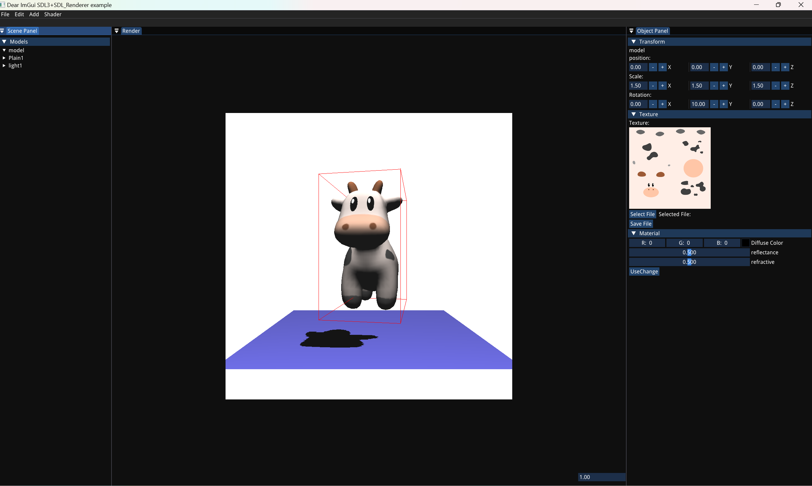

# 基于Dear-Imgui的实时软光栅渲染器

### 项目介绍

Tiny_Renderer 基于C++开发，使用Dear-Imgui作为Gui, SDL3提供硬件支持，实现了完整的 光栅化渲染管线 顶点装配->顶点着色器->图元组装->光栅化->片段着色器），基于Games101所学知识实现了以下内容：

- 正交，透视投影
- 属性插值（坐标插值，纹理插值）
- 深度测试
- Blinn-Phong 光照模型
- 纹理贴图
- shadowmap 阴影



使用Imgui实现了GUI界面，可以设置**相机位置**，**物体变换**，**场景切换和保存**，**纹理加载和切换**，**阴影开关**，**选中效果**等功能。

### 预览

[点这里见Bilibili视频](https://www.bilibili.com/video/BV1hBPFeQERT/?vd_source=3d8f0cd38a3e8b245bde8a4d3f0783be)

- sphere 实时阴影渲染
    
    右侧为灯光视角下的深度贴图

- test 场景更换渲染纹理
    

### Useage

1. 安装环境：`Windows10/Windows11`(暂不支持其他平台，因为使用了Windows的FileDialog)
2. 编译器：`MinGW-w64`,`MSVC`
3. 构建工具 `ninja`,`make`
4. 编译

    ```bash
    git clone https://github.com/DemonWhiteY/TinyRender.git
    cd TinyRender
    mkdir build
    cd build
    cmake ..  //如果使用ninja 编译，请加上参数-G Ninja
    cmake --build . -j  //如果使用ninja  直接ninja
    ./tinyshader
    ```

### Tips

- 本项目使用JSON作为场景导入文件，如要修改场景请修改JSON文件。
- 本项目使用object 作为模型文件，其他文件无法导入。
- 本项目所需第三方库全部在`third_party`文件夹中，无需另行下载
- 本项目仅供学习参考，性能仍有完善空间

### TODO

- 软阴影（Hard、PCF，PCSS）
- 延迟渲染
- 屏幕空间环境光遮蔽SSAO
- 屏幕空间全局光照SSDO
- 屏幕空间光线追踪SSR及其加速结构
